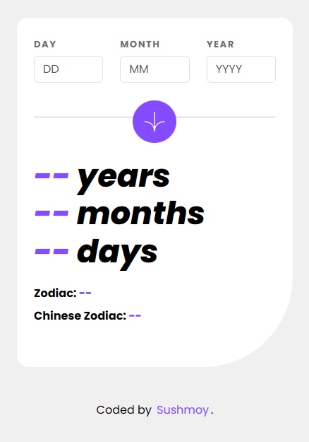

# Age calculator app

This is a solution to the [Age calculator app challenge on Frontend Mentor](https://www.frontendmentor.io/challenges/age-calculator-app-dF9DFFpj-Q).

## Table of contents

- [Overview](#overview)
  - [The challenge](#the-challenge)
  - [Screenshot](#screenshot)
  - [Links](#links)
- [My process](#my-process)
  - [Built with](#built-with)
  - [What I learned](#what-i-learned)

## Overview

### The challenge

Users should be able to:

- View an age in years, months, and days after submitting a valid date through the form
- Receive validation errors if:
  - Any field is empty when the form is submitted
  - The day number is not between 1-31
  - The month number is not between 1-12
  - The year is in the future
  - The date is invalid e.g. 31/04/1991 (there are 30 days in April)
- View the optimal layout for the interface depending on their device's screen size
- See hover and focus states for all interactive elements on the page

Personal Challenge:
- Users can view their zodiac sign name and the chinese zodiac animal name based on their birthdate.

### Screenshot

This is a screenshot of the desktop version of the application.

This is a screenshot of the mobile version of the application.

### Links

- Solution URL: [Solution - Frontend Mentor](https://www.frontendmentor.io/solutions/efficient-age-calculation-with-javascript-and-vuejs-validation-L9dCXc8B0f)
- Live Site URL: [Age Calculator](https://sushcod3.github.io/age-calculator/)

## My process

### Built with

- Vuejs
- Bootstrap

### What I learned

- Calculation process for calculating the age effectively without making the js a mess
- bend css and bootstrap together to work more efficiently
- Vuejs -> Modify to my needs -> CSS -> Bootstrap if needed
- Vuejs: :model, @click, @keyup, v-if, and :class were very helpful for me to create this project
