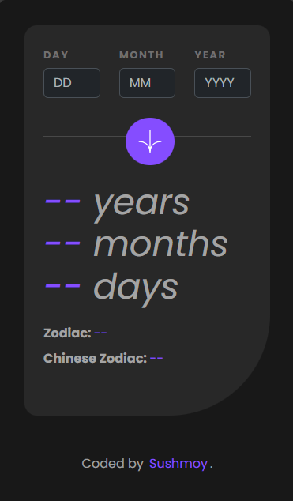

# Age Calculator

Welcome to the Age Calculator App! 
This web application allows users to easily calculate their age based on their birthdate. Simply input your birthdate into the form, and the app will calculate your age in years, months, and days. Additionally, you'll receive validation errors if any incorrect or invalid information is entered.

- Live Site: [Age Calculator](https://sushcod3.github.io/age-calculator/)

## Table of contents

- [Features](#features)
- [Screenshot](#screenshot)
- [Technologies Used](#technologies-used)
- [Lessons Learned](#lessons-learned)
- [Acknowledgments](#acknowledgments)

### Features

- **Age Calculation**: Users can input their birthdate through the form and view their age in years, months, and days.

- **Zodiac Sign and Chinese Zodiac**: Users can view their zodiac sign name and the Chinese zodiac animal name based on their birthdate.

- **Dynamic Light/Dark Mode Support**: The application dynamically adjusts its color scheme based on the user's system-wide color scheme preference.

- **Animation Before Result**: Enhancing user experience, the application incorporates animations to engage users and provide visual feedback before displaying the calculated result.

### Screenshot

Clean and intuitive desktop interface showcasing age calculation and zodiac sign details in light mode.

Mobile-friendly interface with dark mode support for improved readability in low-light conditions.

### Technologies Used

- Vuejs
- CSS
- Bootstrap

### Lessons Learned

- **Efficient Age Calculation**: I improved my understanding of the JavaScript logic required for effective age calculation without cluttering the codebase. Implementing a streamlined calculation process was crucial for ensuring accuracy and performance.

- **Integration of CSS and Bootstrap**: I successfully integrated CSS and Bootstrap to enhance the visual appeal and functionality of the application. This involved leveraging Bootstrap components and utilities while customizing styles to fit the project's requirements.

- **Vue.js Customization**: I learned to adapt Vue.js to suit the specific needs of the project. Utilizing Vue.js directives such as v-model, @click, @keyup, v-if, and :class enabled me to create dynamic and interactive user interfaces efficiently.

- **Dynamic Theme Switching**: Implementing dynamic light/dark mode support enhanced the accessibility and user experience of the application. I gained experience in dynamically changing the theme based on the user's system-wide color scheme preference, improving readability in various lighting conditions.

- **Animation Implementation**: Adding animations to elements using keyframes enriched the user interaction and engagement within the application. By incorporating subtle animations, I enhanced the visual appeal and provided users with intuitive feedback during interactions.

### Acknowledgments

This project is a solution to the challenges provided by [Frontend Mentor](https://www.frontendmentor.io/solutions/efficient-age-calculation-with-javascript-and-vuejs-validation-L9dCXc8B0f), with additional features implemented by me. 
